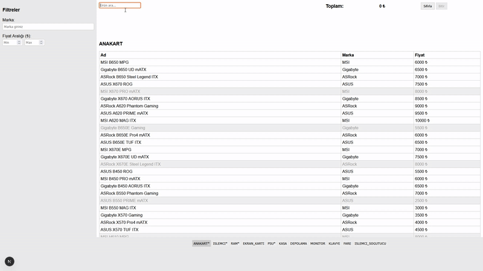

### 🖥️ Bilgisayar Toplama Uygulaması

Bu proje, **Balıkesir Üniversitesi Bilgisayar Mühendisliği**  
**İleri İnternet Programlama** dersi kapsamında hazırlanmış bir ödevdir.

---

#### 🎯 Amaç

Kullanıcının donanım parçalarını seçerek **uyumlu bir bilgisayar sistemi oluşturmasını** sağlayan bir web uygulamasıdır.  
Uygulama, farklı bileşenlerin (anakart, işlemci, RAM, ekran kartı, PSU, kasa vb.) teknik özelliklerini ve stok durumlarını kontrol eder.  
Her adımda yalnızca **uyumlu parçalar** gösterilir ve seçilen ürünlerin toplam fiyatı otomatik hesaplanır.

---

#### ⚙️ Özellikler

- 🔍 Marka, fiyat aralığı ve stok durumuna göre filtreleme  
- 🔄 Parça seçimine göre **otomatik sekme geçişi**  
- 🧩 CPU ↔ Anakart, RAM ↔ Anakart, GPU ↔ PSU gibi temel uyumluluk kontrolleri  
- 💾 Seçimler **tarayıcıda (localStorage)** saklanır  
- 📊 “Bitir” butonu ile seçilen parçaların özetini popup pencerede gösterir  
- ⚡ Sade HTML + CSS düzeni (öğrenci dostu arayüz)

---

#### 🚀 Kurulum ve Çalıştırma

Proje bir **Next.js (TypeScript)** uygulamasıdır.  
Aşağıdaki adımları takip ederek yerel ortamda çalıştırabilirsiniz:

```bash
npm install
npm run dev
```

Ardından tarayıcıda şu adresi açın:
👉 http://localhost:3000

---

#### 📁 JSON Verileri

Tüm ürün verileri /public/data/ dizininde yer almaktadır.
Bu dizinde işlemci, anakart, RAM, PSU, kasa, depolama ve çevre birimleri için ayrı JSON dosyaları bulunur.

---

#### 🧠 Uygulama Akışı

- Kullanıcı önce anakart seçer.
- Sistem bu seçime göre yalnızca uyumlu işlemcileri gösterir.
- Ardından RAM, ekran kartı, PSU ve kasa seçimleri yapılır.
- Tüm zorunlu parçalar seçildiğinde “Bitir” butonu aktifleşir.
- Popup pencerede seçilen ürünlerin listesi ve toplam fiyat gösterilir.

---

#### 🎥 Demo / GIF

Aşağıda uygulamanın genel çalışma akışını gösteren kısa bir örnek bulunmaktadır:

<p align="center">  </p>
